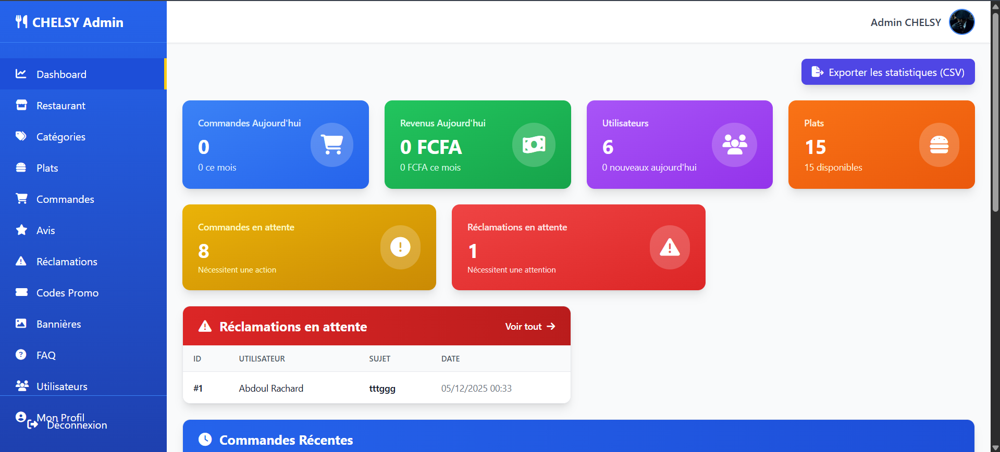
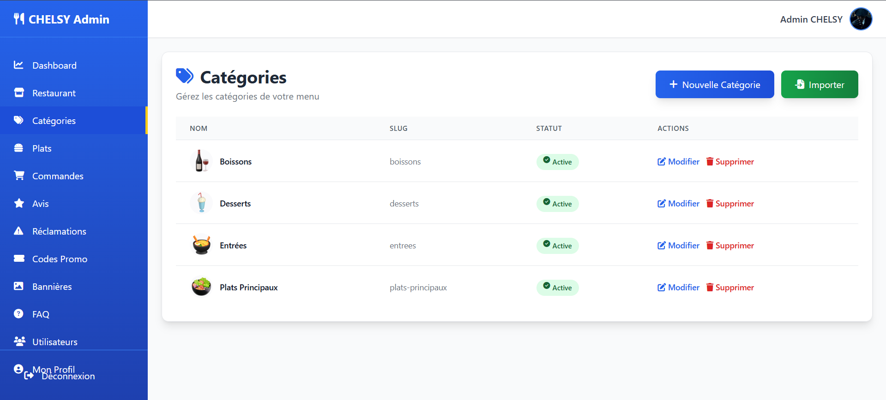
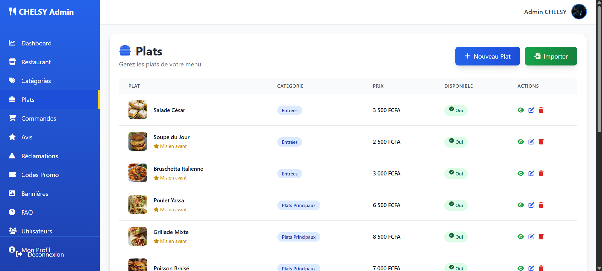

# CHELSY Restaurant — API & Back-office

[](https://laravel.com)
[](https://php.net)
[](https://mysql.com)
[](https://laravel.com/docs/sanctum)
[](https://stripe.com)
[](https://swagger.io)
[](https://tailwindcss.com)
[](https://vitejs.dev)
[](https://firebase.google.com)
[](https://github.com/dompdf/dompdf)
[](http://image.intervention.io)

API REST et dashboard d’administration pour la gestion d’un restaurant : commandes en ligne, paiements, notifications push et suivi des livreurs.


## Démo en ligne

**Application :** [https://chelsy-api.cabinet-xaviertermeau.com/](https://chelsy-api.cabinet-xaviertermeau.com/)

### Compte administrateur de test

| Champ        | Valeur                     |
|-------------|----------------------------|
| **Email**   | `admin@chelsy-restaurant.bj` |
| **Mot de passe** | `admin123`            |


## Aperçu du dashboard admin

### Tableau de bord



### Gestion des catégories



### Gestion des plats




## Fonctionnalités

- **Authentification** — Inscription, connexion, réinitialisation mot de passe
- **Utilisateur** — Profil, adresses, avatar
- **Catalogue** — Catégories, plats, avis, filtres
- **Panier** — Gestion avec options et personnalisation
- **Commandes** — Création, suivi, annulation, factures PDF
- **Paiements** — Espèces, carte (Stripe), Mobile Money (FedaPay)
- **Avis & notations** — Restaurant, plats, livraison
- **Favoris, codes promo, FAQ, réclamations**
- **Dashboard admin** — Gestion des entités, import/export CSV
- **Notifications push** — Firebase Cloud Messaging
- **Suivi GPS** — Position des livreurs en temps réel
- **Documentation API** — Swagger/OpenAPI


## Technologies

| Backend | Frontend / Outils |
|--------|--------------------|
| Laravel 12, PHP 8.2+ | Vite, Tailwind CSS 4, Alpine.js |
| MySQL | Swagger (l5-swagger) |
| Laravel Sanctum | DomPDF, Intervention Image |
| Stripe, FedaPay | Firebase (FCM, JWT) |


## Installation

### Prérequis

- PHP 8.2+, Composer, MySQL, Node.js 18+

### Étapes

```bash
git clone https://github.com/iamrachking/api-chelsy-apk
cd api-chelsy-apk
```

```bash
composer install
cp .env.example .env
php artisan key:generate
```

Configurer la base de données dans `.env`, puis :

```bash
php artisan migrate --seed
php artisan storage:link
npm install && npm run build
```

### Configuration optionnelle

- **Firebase** — Fichier de credentials dans `storage/app/firebase-credentials.json` ou `FIREBASE_SERVER_KEY` dans `.env`
- **Stripe** — `STRIPE_KEY`, `STRIPE_SECRET`, `STRIPE_WEBHOOK_SECRET` dans `.env`


## Documentation API

Générer la doc Swagger :

```bash
php artisan l5-swagger:generate
```

Accès : `http://votre-domaine/api/documentation`

Le fichier `CHELSY_API.http` permet de tester les endpoints (extension REST Client sous VS Code).

### Exemples d’endpoints

| Méthode | Route | Description |
|--------|--------|-------------|
| POST | `/api/v1/register` | Inscription |
| POST | `/api/v1/login` | Connexion |
| GET  | `/api/v1/me` | Utilisateur connecté |
| GET  | `/api/v1/orders` | Liste des commandes |
| POST | `/api/v1/orders` | Créer une commande |
| GET  | `/api/v1/orders/{id}/tracking` | Suivi livraison |


## Commandes utiles

```bash
php artisan l5-swagger:generate   # Régénérer la doc Swagger
php artisan config:clear && php artisan cache:clear
php artisan migrate:fresh --seed   # Réinitialiser la BDD avec seed
```


## Licence

MIT — Projet développé pour **CHELSY Restaurant**.
